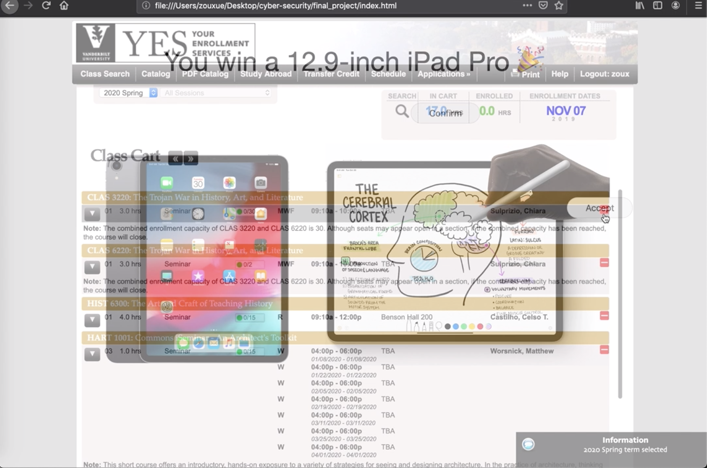
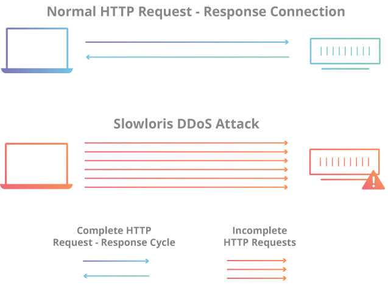

## Clickjacking Attack on YES

by *Xue Zou*

### Overview

This directory aims to address one issue I found in Vanderbilt's student [YES](https://yes.vanderbilt.edu) system and demo possible [Clickjacking](https://www.owasp.org/index.php/Clickjacking) attack on the system, additionally, suggest possible fixing of the vulnerability.

### Description

##### About **Clickjacking attack**:

Clickjacking, also known as UI-Redress attack, misleads the victim by overlaying multiple frames and making some frames invisible. Thus the victim is displayed with one webpage but his/her action is actually on another webpage that is selected by the attackers. This attack takes advantage of the HTML property called **iFrame**. 

When introspecting the network communication in developer tools of YES, **X-Frame-Options** header, which is the most popular way to protect against clickjacking, is not included in the HTTP response to protect against 'ClickJacking' attacks. Additionally, when trying to embed the webpage in an iframe in html `<iframe src="https://yes.vanderbilt.edu" width="100%" height="100%"></iframe>`, the webpage's content loads in the iframe element. Hence the YES is vulnerable to clickjacking attack. 

##### More about **Clickjacking attack**:

One of the most notorious examples of Clickjacking was an attack against the Adobe Flash plugin settings page. By loading this page into an invisible iframe, an attacker could trick a user into altering the security settings of Flash, giving permission for any Flash animation to utilize the computer's microphone and camera. [5]

Clickjacking also made the news in the form of a Twitter worm. This clickjacking attack convinced users to click on a button which caused them to re-tweet the location of the malicious page, and propagated massively. [5]

There have also been clickjacking attacks abusing Facebook's "Like" functionality. Attackers can trick logged-in Facebook users to arbitrarily like fan pages, links, groups, etc. [5]

Here's a illustration of clickjacking attack: [7]


##### Exploit the vulnerability in YES

Then to further exploit the vulnerability, assume that the victim is already logged in YES system. Then we embed the iframe element under the student's session.
```html
<iframe src="https://acad.app.vanderbilt.edu/more/SearchClasses!input.action?commodoreIdToLoad=C05526610"></iframe>
```

When the victim open the link, it is


Here’s the key to a clickjacking attack: the target content is hidden and the attacker’s content sits over the top and effectively tricks the victim into clicking links they don’t know they’re clicking. 

In reality, under the visible is rendering an invisible webpage (set opacity of the background iframe element to 0.5)


When sending request in the hidden iframe, we could later see that the cookie are being passed with the request, and this allows the request to be successfully made to the server. Since the session persists the logged in state which means that for all intents and purposes, this is an authenticated requests from a logged in user, it’s just that they didn’t really intend to issue it. (In this sense, it's a little like a cross site request forgery attack, and this is one of those cases where expiring sessions quickly is a great defense at the expense of usability.)


### Demo for Idea Presentation

- **[a demo Video](./demo.mov)**
- **[web-page source code](./index.html)**

Here in the demo below, I aim to remove the victim's classes from cart. To perform more malicious action, we could perform dropping classes.


### Defending against Clickjacking

#### using X-Frame-Options

The main way of defending against clickjacking using **X-Frame-Options** response header, which is currently not present in YES system.

The X-Frame-Options response header is passed as part of the HTTP response of a web page, indicating whether or not a browser should be allowed to render a page inside a `<frame>` or `<iframe>` tag.

There are three values allowed for the X-Frame-Options header:
1. DENY – does not allow any domain to display this page within a frame

2. SAMEORIGIN – allows the current page to be displayed in a frame on another page, but only within the current domain

3. ALLOW-FROM URI – allows the current page to be displayed in a frame, but only in a specific URI – for example `ALLOW-FROM http://www.example.com`


To implement this approach, a possibly simple way is to implement a filter that automatically adds the header to every page or to add it at Web Application Firewall of Web/Application Server level.

#### Some Limitations of X-Frame-Options

- To enable the SAMEORIGIN option across a website, the X-Frame-Options header needs to be returned as part of the HTTP response for each individual page (cannot be applied cross-site).
- X-Frame-Options does not support a whitelist of allowed domains, so it doesn’t work with multi-domain sites that need to display framed content between them.
- Only one option can be used on a single page, so, for example, it is not possible for the same page to be displayed as a frame both on the current website and an external site.
- The ALLOW-FROM option is not supported by all browsers.
- X-Frame-Options is a deprecated option in most browsers. [7]


More information about other method of defense against clickjacking could be from [Clickjacking Defense cheat sheet](https://cheatsheetseries.owasp.org/cheatsheets/Clickjacking_Defense_Cheat_Sheet.html) from owasp.


### Other Attempts

#### **[CSRF Attack](https://www.owasp.org/index.php/Cross-Site_Request_Forgery_(CSRF))**

By inspecting the code, no anti-CSRF tokens were found in a HTML submission form. Here's are a brief explanation of how csrf attacks works: 

A cross-site request forgery is an attack that involves forcing a victim to send an HTTP request to a target destination without their knowledge or intent in order to perform an action as the victim. The underlying cause is application functionality using predictable URL/form actions in a repeatable way. The nature of the attack is that CSRF exploits the trust that a web site has for a user.

Then, to try to exploit the absence of auti-csrf token, I try to add a course to chart on other's behalf in following snippet of javascript code in another webpage using my already logged in account's browser. 

```javascript
await fetch("https://acad.app.vanderbilt.edu/more/StudentClassExecute!add.action?classNumber=4837&selectedTermCode=0940", {
    "credentials": "include",
    "headers": {
        "User-Agent": "Mozilla/5.0 (Macintosh; Intel Mac OS X 10.14; rv:69.0) Gecko/20100101 Firefox/69.0",
        "Accept": "*/*",
        "Accept-Language": "en-US,en;q=0.5",
        "X-Requested-With": "XMLHttpRequest",
        "Content-Type": "application/x-www-form-urlencoded"
    },
    "referrer": "https://acad.app.vanderbilt.edu/more/SearchClasses!input.action?commodoreIdToLoad=C05526610",
    "method": "GET",
    "mode": "cors"
});
```

But I got rejected because of [same origin policy](https://developer.mozilla.org/en-US/docs/Web/Security/Same-origin_policy). 
```
Cross-Origin Request Blocked: The Same Origin Policy disallows reading the remote resource at https://acad.app.vanderbilt.edu/more/StudentClassExecute!add.action?classNumber=4837&selectedTermCode=0940. (Reason: CORS header ‘Access-Control-Allow-Origin’ missing).
```

Although there's no auti-csrf token presented, the Same Origin Policy which restricts how a document or script loaded from one origin can interact with a resource from another origin, helps prevents the cross-site request and thus also prevents CSRF attack. 

CORS which represents, The *Cross-origin resource sharing*, allows restricted resources on a web page to be requested from another domain outside the domain from which the first resource was served. Request from other domain, in this case are forbidden by default because of the same origin policy.

Some additional notes here: some browsers with [partial CORS support](https://caniuse.com/#search=CORS) allow cross site XHR requests (e.g. IE 10 and earlier), though they do not allow custom headers to be appended. In CORS supported browsers the Origin header cannot be set, preventing an attacker from spoofing this.

#### **Slow Loris Attack** (not related to YES)

Slow Loris Attack is an really interesting type of denial-of-service attack I've found, probably because of the cute naming of slow-moving Asian primate. To explain the process, the attacker sends HTTP request in pieces s l o w l y, one at a time to the web server. So the server waits patiently until all the data shows up, this eventually won't end according to the attack specifications. 

Since the targeted server will only has so many threads available to handle concurrent connections. Each server thread will attempt to stay alive while waiting for the slow request to complete, which never occurs. When the server’s maximum possible connections has been exceeded, each additional connection will not be answered and denial-of-service will occur. Slow loris has proven highly-effective against many popular types of web server software, including Apache 1.x and 2.x, 

An interesting analogy is like: imagine sending 100 old grandmas to a store, with all of them trying to tell a story from their childhood to the cashier so that no other customers can buy anything, and the cashier won't kick the grandmas out of the store until they end up telling the story. [2]

Here's an nice illustration of slow loris attack from [6]:




To test if the system is vulnerable to slow loris attack, one can installed tool [`slowhttptest`](https://github.com/shekyan/slowhttptest) on a Linux virtual machine, which is a highly configurable tool that simulates some Application Layer Denial of Service attacks by prolonging HTTP connections in different ways. 

To run the tool, in the command line, one can do
```
slowhttptest -c 500 -H -g -o ./output_file -i 10 -r 200 -t GET -u [target website's url] -x 24 -p 2
```
The parmaeter -c specifies the target number of connections to establish during the test (normally with 200 should be enough to hang a server that doesn't have protection against this attack). Afterwards, a output chart would display the test result about if the site is vulnerable to slow loris attack.


### References

[2] Article [How to perform a DoS attack "Slow HTTP" with SlowHTTPTest (test your server Slowloris protection) in Kali Linux](https://ourcodeworld.com/articles/read/949/how-to-perform-a-dos-attack-slow-http-with-slowhttptest-test-your-server-slowloris-protection-in-kali-linux)

[3] Article [Is CORS helping in anyway against Cross-Site Forgery?](https://security.stackexchange.com/questions/97825/is-cors-helping-in-anyway-against-cross-site-forgery)

[4] A great [explanation](https://javascript.info/fetch-crossorigin#why-is-cors-needed-a-brief-history) about CORS

[5] Brief explanation of [clickjacking](https://www.owasp.org/index.php/Clickjacking)

[6] Illustration of [Slow Loris attack](
https://www.cloudflare.com/learning/ddos/ddos-attack-tools/slowloris/)

[7] diagram and explanation of [clickjacking](https://www.imperva.com/learn/application-security/clickjacking/)

[8] More [clickjacking](https://javascript.info/clickjacking)

[9] A more laymen term explanation of [clickjacking](https://www.troyhunt.com/clickjack-attack-hidden-threat-right-in/)

